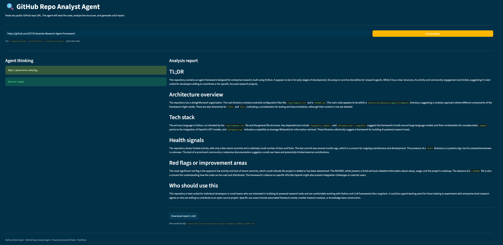

# GitHub Repo Analyst Agent

An autonomous multi-agent system that analyzes any public GitHub repository and generates a structured technical report — architecture, tech stack, health signals, red flags, and improvement suggestions.

Built using a **ReAct agent loop from scratch** — no LangChain, no LangGraph, no frameworks. Just Python, OpenAI, and PyGithub.

---

## Demo

Paste any public GitHub URL → watch the agent think step by step → get a full streamed report with critic review.



---

## How it works

This is not a pipeline. A pipeline calls tools in a fixed order. This agent uses the **ReAct pattern** (Reason → Act → Observe) — at each step, the LLM decides which tool to call next based on everything it has observed so far.

```
User inputs repo URL
        ↓
  RAG — clone repo + index all code into ChromaDB
        ↓
  [ Agent 1 — Analyst ]
  Reason → Act (call tool) → Observe → repeat
        ↓
  Report streamed token by token
        ↓
  [ Agent 2 — Critic ]
  Reviews report → finds weak conclusions
        ↓
  [ Agent 3 — Comparison ] (Compare mode)
  Reads both reports → head-to-head table + recommendation
        ↓
  Full report saved as .md + downloadable
```

**Agent 1** has 5 tools it can call:
- `fetch_repo_metadata` — stars, forks, language, topics, license, last activity
- `fetch_file_tree` — root folder structure, detects README / Dockerfile / tests / CI
- `fetch_file_content` — reads any specific file (README, requirements.txt, main.py)
- `fetch_recent_commits` — last 10 commit messages, dates, authors
- `search_codebase` — semantic search over ALL code files via RAG

---

## Project structure

```
github-repo-analyst-agent/
├── app.py              # Streamlit frontend (single + compare mode)
├── core.py             # ReAct agent loop — streaming + non-streaming
├── prompts.py          # All LLM prompts in one place
├── tools_registry.py   # Maps tool names → functions
├── github_tools.py     # 4 GitHub API tool functions
├── critic_agent.py     # Agent 2 — critiques analyst report
├── compare_agent.py    # Agent 3 — compares two repos head-to-head
├── rag_tool.py         # RAG — clones repo, indexes code into ChromaDB
├── memory.py           # Saves past analyses, tracks changes over time
├── save_report.py      # Saves reports as .md files locally
├── api.py              # FastAPI REST backend
├── config.py           # Reads API keys from .env
├── .env.example        # Copy this to .env and fill keys
├── .gitignore
└── requirements.txt
```

---

## Tech stack

| Layer | Tool |
|---|---|
| LLM | GPT-4o-mini (OpenAI) |
| GitHub API | PyGithub |
| RAG | ChromaDB + sentence-transformers |
| Frontend | Streamlit |
| REST API | FastAPI + uvicorn |
| Agent memory | JSON persistence |
| Agent pattern | ReAct (built from scratch) |
| Config | python-dotenv |

---

## Features across 8 phases

| Phase | Feature |
|---|---|
| 1 | Single ReAct agent, 4 GitHub tools, Streamlit UI |
| 2 | Critic agent — Agent 2 reviews Agent 1's report |
| 3 | RAG over full codebase using ChromaDB |
| 4 | Streaming output token by token |
| 5 | Agent memory — tracks repos across sessions |
| 6 | Compare mode — two repos head-to-head |
| 7 | FastAPI REST backend with async job polling |
| 8 | Deployed on Hugging Face Spaces |

---

## Setup

**1. Clone the repo**
```bash
git clone https://github.com/ES7/Github-Repo-Analyst-Agent
cd Github-Repo-Analyst-Agent
```

**2. Install dependencies**
```bash
pip install -r requirements.txt
```

**3. Set up API keys**
```bash
cp .env.example .env
```

Edit `.env` and fill in:
- `GITHUB_TOKEN` → [github.com/settings/tokens](https://github.com/settings/tokens) — New token (classic), no scopes needed for public repos
- `OPENAI_API_KEY` → [platform.openai.com/api-keys](https://platform.openai.com/api-keys)

**4. Run**
```bash
streamlit run app.py
```

**5. Optional — Run REST API**
```bash
uvicorn api:app --reload
```
API docs available at `http://localhost:8000/docs`

---

## What I learned building this

- The difference between a pipeline and a true agent — the LLM decides, not the code
- How the ReAct loop works under the hood — what every framework hides from you
- How multi-agent systems work — agents with different roles, different prompts, different outputs
- How to combine RAG + Agents — semantic search over actual code, not just surface files
- How to stream LLM output token by token in a Streamlit UI
- How to build agent memory — stateful agents that remember past sessions
- How to expose an agent as a REST API with async job polling
- How to deploy an AI app on Hugging Face Spaces

---

## Author

**Ebad Sayed** — Final year, IIT (ISM) Dhanbad
Co-founder, [VokeAI](https://github.com/ES7) — AI startup, government grant recipient

Connect: [LinkedIn](https://linkedin.com/in/ebadsayed) · [GitHub](https://github.com/ES7)

Medium: [GitHub Repo Analyst Agent](https://medium.com/@sayedebad.777/i-built-a-github-repo-analyst-agent-from-scratch-no-langchain-no-frameworks-d0c6f5a85bf2)
